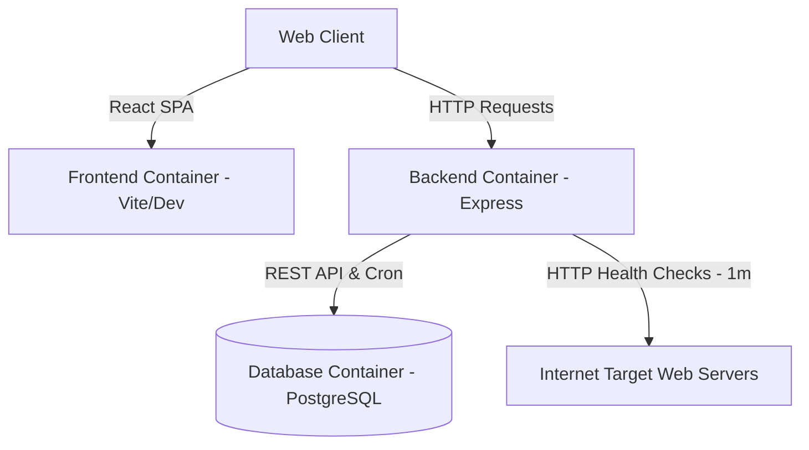
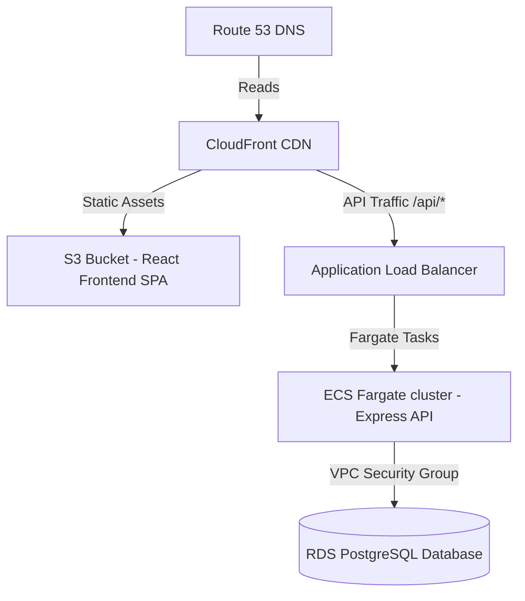

# Uptime Pulse - Real-time Uptime Monitor MVP

A lightweight, real-time uptime monitoring application built with **React (Vite, TypeScript, Tailwind CSS v4)** on the frontend, and **Express (TypeScript, Prisma ORM, PostgreSQL, node-cron)** on the backend. The system periodically checks registered URLs and records HTTP status, response time, and availability metrics.

---

## Architecture Overview



- **Frontend**: A sleek dashboard using Tailwind CSS v4 and responsive design. Features a live 5-second countdown refresh, live status widgets, a timeline check visualization, and a URL history modal.
- **Backend API**: Exposes endpoints to add, retrieve, and delete monitored endpoints.
- **Cron Service**: Background scheduler running once every minute to request all target domains with a 10s timeout, saving responses in PostgreSQL.
- **Database**: Prisma handles relational data with cascade delete. If a URL is deleted, all related checks are pruned.

---

## Setup and Installation

### Prerequisites
- Docker and Docker Compose installed.

### Launching the Stack
1. Clone the repository and navigate to the directory.
2. Build and spin up the containers in one command:
   ```bash
   docker compose up --build
   ```
3. Once running, access the dashboard at:
   - **Frontend Dashboard**: `http://localhost:5173`
   - **Backend API Server**: `http://localhost:5000`
   - **Postgres DB Host Port**: `localhost:5400`

---

## API Documentation

### 1. Register a URL
- **Endpoint**: `POST /urls`
- **Body**:
  ```json
  {
    "url": "https://example.com"
  }
  ```
- **Validation Rules**:
  - String must be a valid absolute HTTP/HTTPS URL.
  - Duplicate URLs are blocked (returns HTTP 400).
- **Response** (HTTP 201):
  ```json
  {
    "id": "a90dfb5c-4eb2-432d-ae00-c9a7852c0022",
    "url": "https://example.com",
    "createdAt": "2026-07-08T13:30:00.000Z"
  }
  ```

### 2. Get Monitored URLs with Latest Status
- **Endpoint**: `GET /urls`
- **Response** (HTTP 200):
  ```json
  [
    {
      "id": "a90dfb5c-4eb2-432d-ae00-c9a7852c0022",
      "url": "https://example.com",
      "createdAt": "2026-07-08T13:30:00.000Z",
      "latestCheck": {
        "id": "e98fc2eb-8288-4c9f-b76b-9c238b1d9bf5",
        "urlId": "a90dfb5c-4eb2-432d-ae00-c9a7852c0022",
        "statusCode": 200,
        "responseTime": 142,
        "isUp": true,
        "checkedAt": "2026-07-08T13:31:00.000Z"
      }
    }
  ]
  ```

### 3. Get Health Check History for a URL
- **Endpoint**: `GET /urls/:id/history`
- **Response** (HTTP 200, ordered newest first):
  ```json
  [
    {
      "id": "e98fc2eb-8288-4c9f-b76b-9c238b1d9bf5",
      "urlId": "a90dfb5c-4eb2-432d-ae00-c9a7852c0022",
      "statusCode": 200,
      "responseTime": 142,
      "isUp": true,
      "checkedAt": "2026-07-08T13:31:00.000Z"
    }
  ]
  ```

### 4. Delete Monitored URL
- **Endpoint**: `DELETE /urls/:id`
- **Response** (HTTP 200):
  ```json
  {
    "message": "URL successfully removed from monitor.",
    "deletedUrl": "https://example.com"
  }
  ```

---

## Verification and Testing Steps

### Test Cases
You can test the system by registering two specific URLs on the dashboard interface:

1. **Successful URL (UP)**: `https://example.com`
   - **Expected Status**: `ONLINE` / `UP` (Green badge).
   - **Expected HTTP Code**: `200` (or appropriate 3xx redirect).
   - **Expected Response Time**: Variable (e.g. `50 ms` - `400 ms`).

2. **Failing URL (DOWN)**: `https://this-url-does-not-exist-123456789.com`
   - **Expected Status**: `OFFLINE` / `DOWN` (Red badge).
   - **Expected HTTP Code**: `NET_ERR` / `null`.
   - **Expected Response Time**: `N/A` (or timed out).

### Step-by-Step Manual Walkthrough
1. Go to `http://localhost:5173`.
2. Type `https://example.com` into the URL input form and click **Monitor URL**.
3. Verify it appears on the dashboard.
4. Type `https://this-url-does-not-exist-123456789.com` and click **Monitor URL**.
5. Observe the initial state. The backend triggers a check within 5 seconds of startup/addition.
6. Verify status badges reflect the correct online status.
7. Click the **History Icon** (`clock/history` button) in the operations column of a row.
8. Check the modal statistics, including average response speed and timeline indicators.
9. Click **Delete** on a row to verify removal.

---

## AWS Deployment Sketch

To migrate this MVP application to production on AWS, follow this structural model:



### 1. Frontend Hosting (S3 + CloudFront)
- **AWS S3**: Run `npm run build` in the frontend folder. Upload the static artifacts (`/dist` index, assets) to an S3 bucket configured for static web hosting. Set permissions to private.
- **AWS CloudFront**: Create a CloudFront Distribution pointing to the S3 bucket as an origin. Configure routing behaviors (redirect errors to index.html for React SPA routing).
- **HTTPS**: Attach a TLS/SSL certificate from AWS Certificate Manager (ACM) to the CloudFront distribution.

### 2. Backend API hosting (ECS Fargate)
- **Docker Image**: Push the built backend Docker container to Amazon Elastic Container Registry (ECR).
- **AWS ECS (Elastic Container Service)**: Setup an ECS Cluster using the serverless AWS Fargate launch type (no EC2 instance management).
- **Service & Tasks**: Create an ECS Task Definition importing the ECR image. Start a Service maintaining 2+ active task instances across multiple availability zones for high availability.
- **Load Balancer**: Configure an Application Load Balancer (ALB) at the VPC boundary to distribute traffic to active Fargate tasks. Setup Route 53 to map API traffic (e.g. `api.yourdomain.com`) to the ALB.

### 3. Database Layer (RDS PostgreSQL)
- **AWS RDS**: Launch a Multi-AZ Amazon RDS PostgreSQL database instance.
- **Security**: Put RDS in private subnets inside your VPC. Define security groups allowing incoming port 5432 traffic *only* from the backend ECS security group.
- **Prisma Migrations**: Run Prisma DB push/migrations as part of the ECS deployment pipeline (e.g., in a CodeDeploy hook or target task) instead of in the web container task loop.

### 4. Hypothetical Terraform Snippet

```hcl
# --- Networking ---
resource "aws_vpc" "main" {
  cidr_block           = "10.0.0.0/16"
  enable_dns_support   = true
  enable_dns_hostnames = true
}

resource "aws_subnet" "public" {
  count             = 2
  vpc_id            = aws_vpc.main.id
  cidr_block        = cidrsubnet(aws_vpc.main.cidr_block, 8, count.index)
  availability_zone = data.aws_availability_zones.available.names[count.index]
}

resource "aws_subnet" "private" {
  count             = 2
  vpc_id            = aws_vpc.main.id
  cidr_block        = cidrsubnet(aws_vpc.main.cidr_block, 8, count.index + 10)
  availability_zone = data.aws_availability_zones.available.names[count.index]
}

# --- RDS PostgreSQL ---
resource "aws_db_instance" "postgres" {
  identifier           = "uptime-monitor-db"
  engine               = "postgres"
  engine_version       = "15"
  instance_class       = "db.t3.micro"
  allocated_storage    = 20
  db_name              = "uptime_monitor"
  username             = var.db_username
  password             = var.db_password
  db_subnet_group_name = aws_db_subnet_group.private.name
  vpc_security_group_ids = [aws_security_group.rds.id]
  skip_final_snapshot  = true
}

# --- ECS Fargate (Backend) ---
resource "aws_ecs_cluster" "main" {
  name = "uptime-monitor-cluster"
}

resource "aws_ecs_task_definition" "backend" {
  family                   = "uptime-monitor-backend"
  network_mode             = "awsvpc"
  requires_compatibilities = ["FARGATE"]
  cpu                      = "256"
  memory                   = "512"
  execution_role_arn       = aws_iam_role.ecs_execution.arn

  container_definitions = jsonencode([{
    name      = "backend"
    image     = "${aws_ecr_repository.backend.repository_url}:latest"
    portMappings = [{ containerPort = 5000, protocol = "tcp" }]
    environment = [
      { name = "DATABASE_URL", value = "postgresql://${var.db_username}:${var.db_password}@${aws_db_instance.postgres.endpoint}/uptime_monitor" },
      { name = "PORT", value = "5000" }
    ]
  }])
}

resource "aws_ecs_service" "backend" {
  name            = "uptime-monitor-backend"
  cluster         = aws_ecs_cluster.main.id
  task_definition = aws_ecs_task_definition.backend.arn
  desired_count   = 2
  launch_type     = "FARGATE"

  network_configuration {
    subnets          = aws_subnet.private[*].id
    security_groups  = [aws_security_group.ecs.id]
    assign_public_ip = false
  }

  load_balancer {
    target_group_arn = aws_lb_target_group.backend.arn
    container_name   = "backend"
    container_port   = 5000
  }
}

# --- S3 + CloudFront (Frontend) ---
resource "aws_s3_bucket" "frontend" {
  bucket = "uptime-monitor-frontend"
}

resource "aws_cloudfront_distribution" "frontend" {
  origin {
    domain_name = aws_s3_bucket.frontend.bucket_regional_domain_name
    origin_id   = "s3-frontend"
  }
  enabled             = true
  default_root_object = "index.html"

  default_cache_behavior {
    allowed_methods  = ["GET", "HEAD"]
    cached_methods   = ["GET", "HEAD"]
    target_origin_id = "s3-frontend"
    viewer_protocol_policy = "redirect-to-https"
    forwarded_values { query_string = false; cookies { forward = "none" } }
  }

  # SPA fallback: serve index.html for 404s
  custom_error_response {
    error_code         = 404
    response_code      = 200
    response_page_path = "/index.html"
  }
}
```

